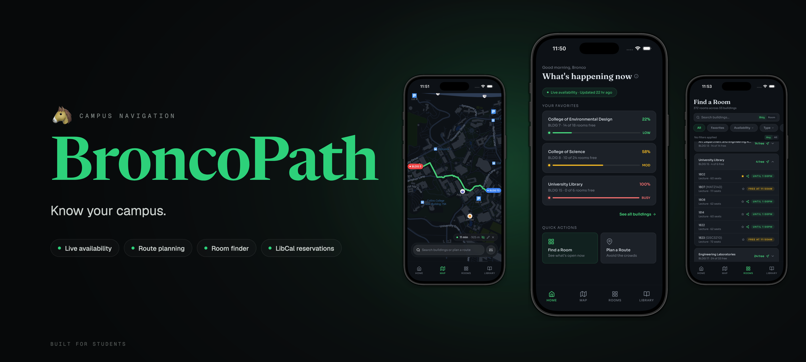

<div align="center">

# 🐴 BroncoPath 🐴

**Crowd-aware campus navigation for Cal Poly Pomona**

_Know your campus. Beat the crowd. Find your space._

<br/>




</div>

## What is BroncoPath?

CPP's existing campus map tells you where buildings are. BroncoPath tells you **how busy they are right now** and **the best route to them**.

BroncoPath is a mobile application that scrapes Cal Poly Pomona's publicly available class schedule data to predict building and classroom occupancy in real time — no sensors, no hardware, no institutional IT contracts required. Students can find a quiet study room, avoid crowded areas between classes, and navigate campus smarter.

This project was created following Agile Methodologies (Scrum) with an AI-augmented workflow under CS4800 Software Engineering at Cal Poly Pomona (Spring 2026). View project deliverables in [`docs/deliverables/`](docs/deliverables/).

| Feature           | Description                                                         |
| ----------------- | ------------------------------------------------------------------- |
| 📊 Live Dashboard | Building-by-building occupancy overview at the current time         |
| 🗺️ Campus Map     | Interactive map with color-coded crowd density markers              |
| 🚪 Room Finder    | Browse available classrooms and study rooms by building             |
| 🧭 Route Planner  | Crowd-avoiding Dijkstra routes integrated directly into the Map tab |
| 📚 Library        | CPP LibCal room booking via SSO handoff                             |

## Tech Stack

**Mobile**

- [React Native](https://reactnative.dev/) + [Expo SDK](https://expo.dev/) with [Expo Router v4](https://docs.expo.dev/router/introduction/)
- [NativeWind v4](https://www.nativewind.dev/) — Tailwind CSS for React Native
- [@maplibre/maplibre-react-native](https://github.com/maplibre/maplibre-react-native) — MapLibre GL for interactive campus map rendering
- Custom hooks + module-level singleton cache — data fetching, prefetch on launch, 60s polling
- Client-side Dijkstra routing engine over OSM-derived campus graph (shortest + least-crowded variants)
- `expo-location` + MapLibre `LocationManager` — live GPS tracking with auto-reroute

**Backend**

- [Node.js](https://nodejs.org/) + [Express](https://expressjs.com/) — REST API
- [Neon](https://neon.tech/) — serverless PostgreSQL
- [Drizzle ORM](https://orm.drizzle.team/) — type-safe database queries
- OSM campus graph (6,015 nodes / 12,700 edges) stored in Neon and served via `/api/campus-graph`

**Data Pipeline**

- Python + Playwright + BeautifulSoup — schedule scraper
- Data source: [schedule.cpp.edu](https://schedule.cpp.edu) (public, updated nightly)

## Getting Started

### Prerequisites

- Node.js 18+
- npm
- Xcode 15+ with the iOS Simulator

### Installation

```bash
git clone https://github.com/lebuckman/broncopath.git
cd broncopath
npm install
```

### Starting the backend

The app fetches live data from the Express backend — it must be running before you launch the app.

```bash
cd backend
npm install   # first time only
npm run dev
```

The server starts on `http://localhost:3000`. Copy `.env.example` to `.env.local` in the project root if you haven't already — `EXPO_PUBLIC_API_BASE_URL` defaults to `http://localhost:3000`.

> [!Note]
> The backend connects to a Neon (serverless PostgreSQL) database. Ensure `DATABASE_URL` is set in `backend/.env` before running.

### Running on iOS

BroncoPath uses Expo SDK 55, which requires a full native build — the prebuilt Expo Go app only supports up to SDK 54. Use `expo run:ios` instead of `expo start`.

```bash
npx expo run:ios
```

> [!Note]
> Xcode compiles the native binary and installs it on the Simulator (first build takes a few minutes). Once it finishes, the Metro bundler starts and the app loads. If the Simulator doesn't jump straight to the app, find **BroncoPath** on its home screen and open it — Metro will connect automatically.
>
> From that point on, JavaScript changes hot-reload without a rebuild. You only need to re-run `expo run:ios` when you install a new native package.
>
> **Metro cache stale?** Run `npx expo start --clear` to flush it.

## Project Structure

```
broncopath/
├── app/                        # Expo Router screens
│   ├── _layout.tsx             # Root layout + branded loading screen
│   └── (tabs)/
│       ├── _layout.tsx         # Tab navigator
│       ├── index.tsx           # Home / Dashboard
│       ├── map.tsx             # Campus Map + integrated Route Planner
│       ├── rooms.tsx           # Find a Room
│       └── library.tsx         # CPP LibCal room booking (SSO handoff)
│
├── components/
│   ├── LoadingScreen.tsx       # Branded launch screen with data prefetch
│   ├── ui/                     # Primitive components (badges, buttons, filters)
│   ├── building/               # Building cards, accordions, detail sheet
│   └── map/                    # Markers, FloatingMapSearchBar, RoutePlannerSheet
│
├── constants/                  # Colors, fonts, types, campus config
├── hooks/                      # useBuildings, useRooms, useFavorites, useCampusGraph,
│                               #   useCongestion, useUserLocation
├── lib/                        # API client, data cache, room filters, routing utilities
├── docs/
│   ├── deliverables/           # Agile/Scrum deliverables
│   └── contexts/               # AI context references
│       ├── DESIGN.md           # Visual design system
│       └── REQUIREMENTS.md     # Engineering requirements & API contracts
│
└── backend/                    # Express API + Drizzle schema
    ├── src/
    │   ├── buildings.ts        # Buildings + rooms endpoints
    │   ├── campusGraph.ts      # Campus graph version + full graph endpoints
    │   ├── schedules.ts        # Schedule data endpoints
    │   ├── serviceFunctions.ts # Room status derived from schedule data
    │   ├── db/                 # Drizzle schema + Neon connection
    │   └── index.ts            # Express entry point
    └── scraper/                # Python CPP schedule scraper
```
